# Quantization Lab: A Matrix-Level Study of Low-Bit Quantization, Outlier Pressure, and Preprocessing Transformations

Status: living draft. This document should be updated as experiments, figures, and conclusions mature.

## Abstract

This project studies low-bit quantization from a deliberately small and inspectable starting point: synthetic matrices. The central question is how symmetric low-bit quantization changes matrix values, reconstruction error, singular-value structure, and integer-code usage under different distributional conditions. We first build a matrix-level quantization sandbox with Gaussian, heavy-tailed, and outlier-injected matrices. We then compare INT8 and INT4 symmetric quantization using reconstruction metrics, spectrum diagnostics, residual plots, histograms, and benchmark-style dashboards. We then test ParoQuant-inspired preprocessing transformations — pairwise Givens rotations, reversible per-channel scaling — and two grouped quantization strategies: column-grouped (one scale per block of columns) and row-grouped (one scale per block of rows within each column, the approach used by GPTQ and AWQ).

The current evidence shows that INT4 is highly sensitive to outlier-dominated scales, producing elevated reconstruction error and high zero-code fractions. Per-channel scaling substantially reduces this failure mode. A key new finding is that column-grouped quantization offers no improvement over global INT4 when outliers are confined to a single row, because every column group still contains that row. Row-grouped quantization directly addresses this: in a controlled row-outlier example, row-grouping with group size 4 reduces MSE by 6× and zero fraction from 92% to 23% compared with global INT4, while column-grouped quantization at any group size leaves both metrics unchanged. We treat these as promising observations pending broader sweeps.

## 1. Research Motivation

Low-bit quantization replaces high-precision weights with a finite set of representable integer codes. This can reduce memory and compute cost, but it also introduces reconstruction error. The key problem studied here is **outlier pressure**: if a small number of unusually large values determine the quantization scale, ordinary values are represented coarsely and may collapse toward zero.

For a matrix $W \in \mathbb{R}^{m \times n}$, symmetric full-matrix quantization with bitwidth $b$ uses a single scale

$$
s = \frac{\max_{i,j}|W_{ij}|}{2^{b-1} - 1}.
$$

The integer code matrix is

$$
Q = \mathrm{clip}\left(\mathrm{round}(W / s), q_{\min}, q_{\max}\right),
$$

and the dequantized reconstruction is

$$
\hat{W} = sQ.
$$

For INT8, the integer range is $[-127, 127]$. For INT4, the range is $[-7, 7]$. INT4 has far fewer available codes, so it is much more vulnerable when the scale is set by extreme values.

This project therefore asks:

1. How does INT4 change matrix values compared with INT8?
2. Which metrics reveal different aspects of quantization error?
3. How do heavy tails and outliers change low-bit failure modes?
4. Can rotations and scaling reduce outlier pressure before quantization?
5. Which findings are robust enough to become claims, and which remain hypotheses?

## 2. Experimental Sandbox

The project currently uses three synthetic matrix families:

- **Gaussian matrices**: entries sampled independently from $x_{ij} \sim \mathcal{N}(\mu,\sigma^2)$.
- **Heavy-tailed matrices**: entries sampled from a scaled Student-t distribution, $x_{ij} = s \cdot t_{\nu}$.
- **Outlier matrices**: Gaussian base matrices with a controlled fraction of entries replaced by large signed outliers.

These families are not intended to model neural-network weights perfectly. They are controlled test cases for learning how quantization behaves as distributional assumptions become less friendly.

Figure:

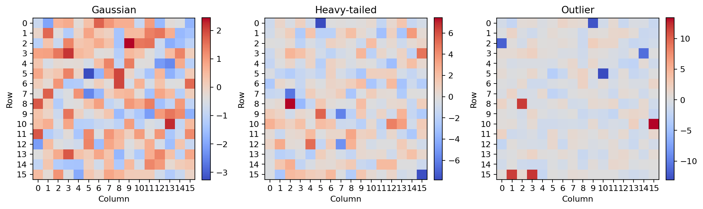

The Gaussian case is a relatively benign baseline. The heavy-tailed and outlier cases are stress tests for global scaling: a few large values can dominate the scale and reduce effective resolution elsewhere.

## 3. Quantization Error Metrics

Let $W$ be the original matrix and $\hat{W}$ the reconstructed matrix after quantization and dequantization. Let the residual be

$$
E = \hat{W} - W.
$$

The project currently reports the following metrics.

### Mean Squared Error

$$
\mathrm{MSE}(W,\hat{W}) = \frac{1}{mn}\sum_{i,j} E_{ij}^{2}.
$$

MSE measures average squared reconstruction error. It is sensitive to larger residuals.

### Mean Absolute Error

$$
\mathrm{MAE}(W,\hat{W}) = \frac{1}{mn}\sum_{i,j}|E_{ij}|.
$$

MAE is easier to interpret in the original value scale and is less dominated by large residuals than MSE.

### Relative Frobenius Error

$$
\frac{\|W-\hat{W}\|_F}{\|W\|_F}.
$$

This normalizes the reconstruction error by the energy of the original matrix, which makes comparisons across matrix scales more meaningful.

### Cosine Similarity

After flattening both matrices,

$$
\frac{\langle W, \hat{W}\rangle}{\|W\|_2\|\hat{W}\|_2}.
$$

Cosine similarity measures whether the reconstruction points in a similar direction to the original, even if its magnitude changes.

### Signal-to-Noise Ratio

The project computes SNR in decibels as

$$
\mathrm{SNR}_{dB} = 10\log_{10}\left(\frac{\sum_{i,j}W_{ij}^2}{\sum_{i,j}(W_{ij}-\hat{W}_{ij})^2}\right).
$$

Higher SNR means the signal energy dominates the reconstruction noise.

### Spectrum Error

Let $\sigma(W)$ denote the vector of singular values of $W$. The relative spectrum error is

$$
\frac{\|\sigma(W)-\sigma(\hat{W})\|_2}{\|\sigma(W)\|_2}.
$$

This measures how much quantization changes the singular-value geometry of the matrix.

### Zero Fraction and Saturation Fraction

For integer codes $Q$:

$$
\mathrm{zero\_fraction} = \frac{|\{(i,j): Q_{ij}=0\}|}{mn},
$$

and

$$
\mathrm{saturation\_fraction} = \frac{|\{(i,j): Q_{ij}=q_{\min} \text{ or } Q_{ij}=q_{\max}\}|}{mn}.
$$

High zero fraction can indicate collapse of ordinary values toward zero. High saturation fraction can indicate many values hitting the representable range boundary.

## 4. Example: INT8 vs INT4 on a Gaussian Matrix

We first quantize a Gaussian matrix with INT8 and INT4 using the same symmetric full-matrix quantization rule.

Figure:

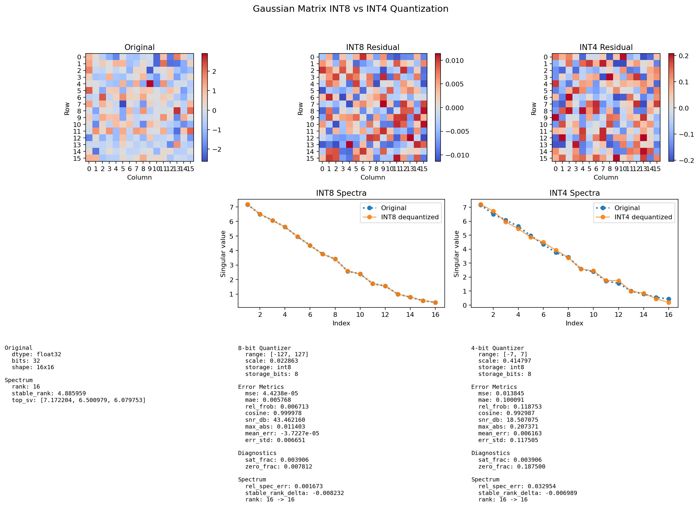

For this example, INT8 reconstructs the matrix with very small error, while INT4 introduces visibly larger residuals and a much higher zero-code fraction.

| Quantizer | MSE | Rel. Frobenius | SNR dB | Zero frac | Sat. frac |
| --- | ---: | ---: | ---: | ---: | ---: |
| INT8 | 0.000044 | 0.006713 | 43.462 | 0.007812 | 0.003906 |
| INT4 | 0.013845 | 0.118753 | 18.507 | 0.187500 | 0.003906 |

This example illustrates an important baseline learning: INT4 can still preserve broad structure on a benign Gaussian matrix, but the reduction from 255 signed levels to 15 signed levels produces a large jump in reconstruction error.

## 5. Example: Outlier-Driven Failure Modes

The outlier matrix case makes the scale problem sharper. A small number of large values increase $s$, which coarsens the representation of smaller entries.

Figure:

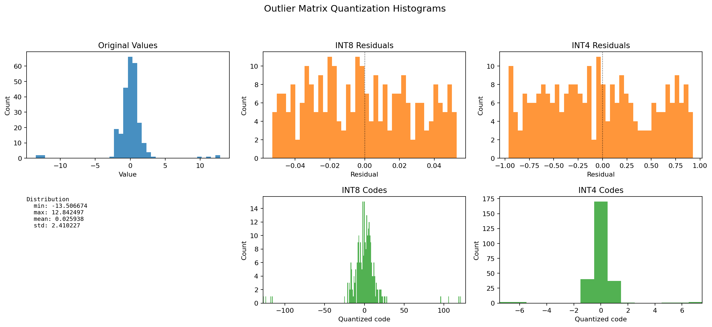

In the outlier example below, INT4 has much higher MSE and a high zero fraction.

| Quantizer | MSE | Rel. Frobenius | SNR dB | Zero frac | Sat. frac |
| --- | ---: | ---: | ---: | ---: | ---: |
| INT8 | 0.000892 | 0.012393 | 38.136 | 0.058594 | 0.003906 |
| INT4 | 0.297624 | 0.226335 | 12.905 | 0.664062 | 0.015625 |

This supports the central working hypothesis of the project: low-bit global quantization is not only a question of bitwidth, but also a question of distribution shape. Outliers can make an otherwise ordinary matrix difficult to represent with INT4.

## 6. Baseline and Outlier Sweep Analysis

The baseline experiment compares INT8 and INT4 across Gaussian, heavy-tailed, and outlier matrix families. The outlier experiment sweeps outlier fraction and outlier scale. The analysis helper converts these CSV outputs into a single dashboard.

Figure:

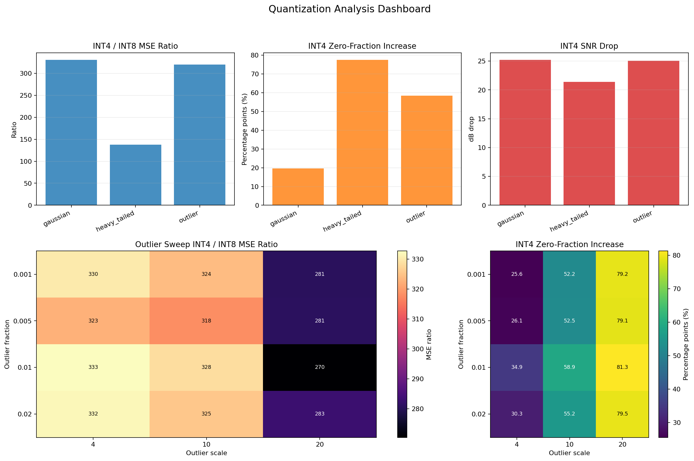

Current findings from the analysis dashboard:

- INT4 error is consistently much larger than INT8 error in the tested matrix families.
- Heavy-tailed INT4 has a particularly high zero fraction.
- Increasing outlier scale tends to increase zero-code pressure in INT4.
- The visual dashboard is useful because MSE, SNR, zero fraction, and outlier severity tell complementary parts of the story.

At this stage, the dashboard is best interpreted as a diagnostic tool, not as a final benchmark. The synthetic examples are small and intentionally controlled.

## 7. Test Cases as Mathematical Evidence

The project uses tests not only as software checks, but also as compact mathematical examples.

### Givens Rotations

A pairwise Givens rotation between columns $i$ and $j$ uses

$$
R_{ij}(\theta)=
\begin{bmatrix}
\cos\theta & -\sin\theta \\
\sin\theta & \cos\theta
\end{bmatrix}.
$$

Right-multiplying $W$ by the corresponding full identity-embedded matrix rotates two columns while preserving Frobenius norm:

$$
W' = WR, \qquad \|W'\|_F = \|W\|_F.
$$

Current tests verify:

- applying a rotation and its inverse reconstructs the original matrix;
- rotations preserve Frobenius norm;
- the analytic angle $\theta=\arctan2(b,a)$ can zero a selected entry;
- cascaded rotations can implement Givens QR;
- a Jacobi-style angle can orthogonalize a column pair.

These tests turn implementation details into reusable research facts.

### Per-Channel Scaling

Per-channel scaling computes one positive factor per column. Let

$$
m_j = \max_i |W_{ij}|.
$$

For a target max-absolute value $\tau$, nonzero columns receive

$$
d_j = \frac{\tau}{m_j}.
$$

The scaled matrix is

$$
W' = WD,
$$

where $D=\mathrm{diag}(d_1,\dots,d_n)$. The inverse transform is

$$
W = W'D^{-1}.
$$

Tests verify that scaling is reversible up to floating-point rounding, that zero columns receive identity factors, and that column max-absolute imbalance is reduced.

## 8. Global Scaling vs Channel-Wise Scaling

The channel-scaling dashboard compares:

1. global INT4 quantization;
2. per-channel scaled INT4 quantization, followed by inverse scaling.

Figure:

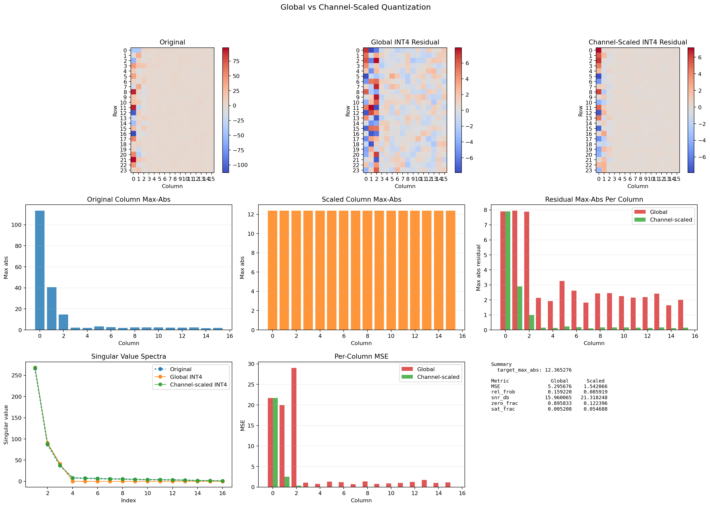

This figure is designed to answer a specific question: does balancing column magnitudes before quantization reduce error in columns that would otherwise be poorly represented by a single global scale?

The current example shows that channel scaling can dramatically lower zero fraction and per-column error on an imbalanced matrix. However, this is still a controlled example. It motivates broader experiments rather than closing the question.

## 9. Rotation and Scaling Experiment

The first Milestone 2 experiment compares four INT4 paths on one controlled outlier-heavy matrix.

### Paths

Baseline:

$$
W \rightarrow \mathrm{INT4} \rightarrow \hat{W}.
$$

Rotation only:

$$
W \rightarrow WR \rightarrow \mathrm{INT4} \rightarrow \widehat{WR} \rightarrow \widehat{W}=\widehat{WR}R^{-1}.
$$

Scaling only:

$$
W \rightarrow WD \rightarrow \mathrm{INT4} \rightarrow \widehat{WD} \rightarrow \widehat{W}=\widehat{WD}D^{-1}.
$$

Rotation followed by scaling:

$$
W \rightarrow WR \rightarrow WRD \rightarrow \mathrm{INT4} \rightarrow \widehat{WRD} \rightarrow \widehat{W}=\widehat{WRD}D^{-1}R^{-1}.
$$

Figure:

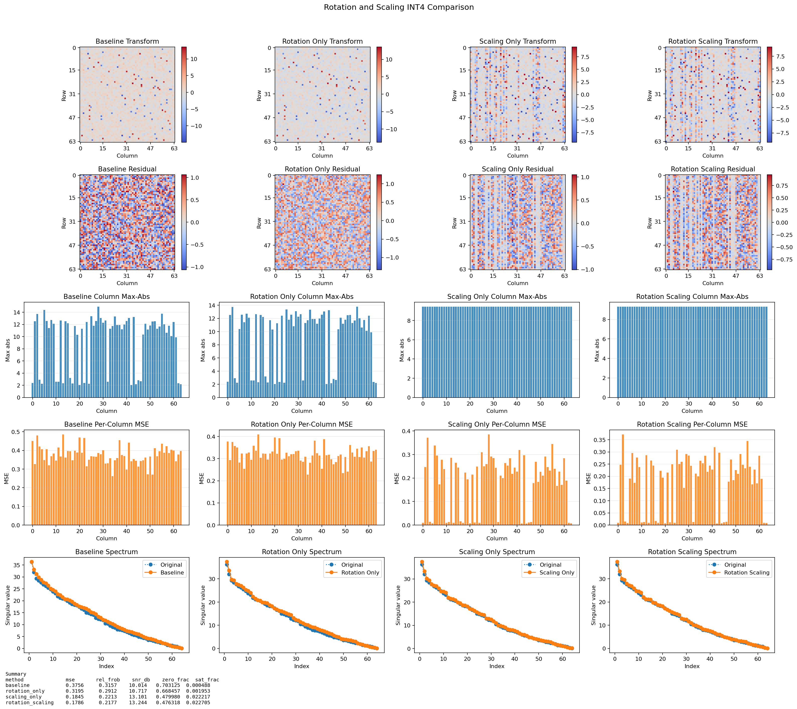

Current default-run metrics:

| Method | MSE | Rel. Frobenius | SNR dB | Zero frac | Sat. frac |
| --- | ---: | ---: | ---: | ---: | ---: |
| Baseline | 0.3756 | 0.3157 | 10.014 | 0.703125 | 0.000488 |
| Rotation only | 0.3195 | 0.2912 | 10.717 | 0.668457 | 0.001953 |
| Scaling only | 0.1845 | 0.2213 | 13.101 | 0.479980 | 0.022217 |
| Rotation + scaling | 0.1786 | 0.2177 | 13.244 | 0.476318 | 0.022705 |

In this single run, rotation + scaling is best among the four paths on MSE, relative Frobenius error, SNR, and zero fraction. The interpretation should be cautious. The improvement over scaling alone is modest, while the improvement from baseline to scaling is large. The current evidence therefore supports the narrower claim:

> Per-channel scaling substantially improves this controlled INT4 example, and rotation + scaling gives a small additional improvement in this run.

It does not yet justify the broad claim that rotation + scaling is always the best strategy.

### 9.1 Top-Width Sparse Rotation Selection

The rotation primitive now also supports a ParoQuant-style sparse pair-selection
path. For each channel $c$, define its width as

$$
w_c = \max_i |W_{i,c}|.
$$

All unordered channel pairs $(a,b)$ are scored by width difference:

$$
\Delta_{a,b} = |w_a - w_b|.
$$

Given a percentage $p$, the implementation sorts pairs by $\Delta_{a,b}$,
keeps the top $p$ percent as candidates, then greedily selects an independent
subset so each channel appears in at most one pair. Each selected pair is
rotated with the same max-abs grid-search angle used by the existing rotation
primitive. In the sweep API this creates opt-in paths such as
`top_width_rotate_p10_global`, `top_width_rotate_scale_p10_global`, and
`top_width_rotate_scale_p10_row_g4`.

This is closer to ParoQuant's motivation than the earlier single-pair heuristic,
which selected only the two largest-width columns. The current implementation is
still not the full ParoQuant optimizer: angles are chosen by a matrix-level
max-abs objective, not by calibration-data layer loss.

For all rotation experiments going forward, result tables and CSVs should report
`rotation_count`, actual `rotation_pair_fraction`, and, when a candidate-pool
selector is used, `rotation_candidate_fraction`. Non-rotation baselines use
0, 0.0, and 0.0. The historical 32×32 and 320×320 sweep results below used one pair
rotation per matrix for the `rotate_*` paths: 1 of 496 possible pairs for
32×32 matrices (0.2016%) and 1 of 51,040 possible pairs for 320×320 matrices
(0.0020%).

## 10. Grouped Quantization

### 10.1 Column-Grouped Quantization

The first grouped strategy splits the matrix into contiguous **column blocks**, each receiving its own scale. For a column-group $W_g$ and bitwidth $b$,

$$
s_g = \frac{\max |W_g|}{2^{b-1}-1},
$$

with codes

$$
Q_g = \mathrm{clip}\left(\mathrm{round}(W_g / s_g), q_{\min}, q_{\max}\right),
$$

and reconstruction $\hat{W}_g = s_g Q_g$. When one column contains an extreme value, only that group's scale is inflated; all other column groups retain tight scales.

On the column-outlier example from Section 5, column-grouped INT4 improves over global INT4, and per-column grouping improves substantially more:

| Method | MSE | Rel. Frobenius | SNR dB | Zero frac |
| --- | ---: | ---: | ---: | ---: |
| Global INT4 | 0.297624 | 0.226335 | 12.905 | 0.664062 |
| Column-grouped INT4 (group=4 cols) | 0.275787 | 0.217873 | 13.236 | 0.652344 |
| Column-grouped INT4 (group=1 col) | 0.089124 | 0.123855 | 18.142 | 0.339844 |

### 10.2 Row-Grouped Quantization

Column-grouped quantization has a blind spot: if an outlier appears in a **single row** that spans many columns, every column group is affected and the scale improvements vanish. The standard industry approach — used in GPTQ and AWQ — addresses this by grouping **rows within each column**. Each column is split independently into row groups of size $g$, giving one scale per group per column:

$$
s_{c,k} = \frac{\max_{i \in \text{group } k} |W_{i,c}|}{2^{b-1}-1}.
$$

This yields $n_{\mathrm{cols}} \times \lceil n_{\mathrm{rows}} / g \rceil$ scales in total. An outlier confined to a row group inflates only that group's scale; all other row groups in all columns are unaffected.

### 10.3 Column-Grouped vs Row-Grouped: A Critical Comparison

The distinction becomes concrete when a row-level outlier is present. The following example uses a $16 \times 16$ Gaussian matrix (seed 42) with the entire first row set to 30.0 (approximately 30× the background standard deviation).

| Method | MSE | Rel. Frobenius | SNR dB | Zero frac |
| --- | ---: | ---: | ---: | ---: |
| Global INT4 | 0.769182 | 0.116081 | 18.705 | 0.921875 |
| Column-grouped INT4 (group=4 cols) | 0.769182 | 0.116081 | 18.705 | 0.921875 |
| Column-grouped INT4 (group=1 col) | 0.769182 | 0.116081 | 18.705 | 0.921875 |
| Row-grouped INT4 (group=4 rows) | 0.109244 | 0.043747 | 27.181 | 0.226562 |
| Row-grouped INT4 (group=1 row) | 0.000000 | 0.000000 | ∞ | 0.000000 |

Column-grouped quantization provides **no improvement at any group size**: because the outlier row is present in every column group, every group's scale is dominated by it regardless of how the columns are partitioned. Row-grouped quantization at group size 4 reduces MSE by 7× and zero fraction from 92% to 23%. At group size 1 (one scale per element per column), reconstruction is exact up to floating-point rounding.

This demonstrates that the choice of grouping axis matters as much as the number of groups. When outliers are row-localised, only row-grouped quantization addresses the root cause.

### 10.4 Implications for the Comparison Landscape

Grouped quantization expands the set of quantization paths that should be compared:

$$
\text{global INT4},\quad \text{column-grouped INT4},\quad \text{row-grouped INT4},\quad
\text{rotation/scaling + any of the above}.
$$

## 11. Current Findings

The project has produced the following working findings.

1. INT4 is much more sensitive than INT8 to outliers under global symmetric quantization.
2. Zero fraction is an important diagnostic because it reveals collapse toward the zero code.
3. Spectrum plots reveal whether reconstruction preserves the global geometry of the matrix, not only entrywise values.
4. Givens rotations preserve matrix energy and can redistribute outlier pressure.
5. Per-channel scaling is reversible and directly reduces column magnitude imbalance.
6. In the first rotation/scaling experiment, scaling explains most of the observed improvement, while rotation + scaling is the best path but only by a small margin over scaling alone.
7. Column-grouped quantization improves over global INT4 when outliers are column-localised, but provides no benefit when outliers are row-localised, because the outlier row spans every column group regardless of group size.
8. Row-grouped quantization (one scale per row-group per column, the GPTQ/AWQ approach) directly addresses row-localised outliers. In a controlled row-outlier example, row-grouping with group size 4 reduces MSE by 7× and zero fraction from 92% to 23% compared with global INT4, while column-grouped quantization leaves both metrics unchanged at any group size.
9. The comparative sweep (5 seeds × 3 outlier fractions × 3 outlier scales = 45 conditions, 12 methods each) produces the following MSE ratios relative to global INT4. Each table entry is aggregated across all sweep conditions: MSE ratio is computed condition-wise as method MSE divided by global INT4 MSE on the same matrix, then reported as mean and standard deviation across the 45 conditions. The standard deviations describe spread over seeds and outlier severities; they are not confidence intervals.

Rotation budget for the shown 32×32 results: the `rotate_global`,
`rotate_scale_global`, and `rotate_scale_row_g*` methods used exactly **one**
pair rotation per matrix condition. A 32-column matrix has
$32 \times 31 / 2 = 496$ possible unordered channel pairs, so the rotation
budget was **1/496 pairs = 0.2016%** of possible pairs per condition. Non-rotation
methods used zero rotations.

| Method | MSE ratio mean | MSE ratio std | Zero frac mean | Zero frac std |
|---|---:|---:|---:|---:|
| rotate_scale_row_g4 | **0.111** | 0.059 | 0.137 | 0.053 |
| row_grouped_g4 | **0.111** | 0.059 | 0.136 | 0.053 |
| rotate_scale_row_g8 | 0.216 | 0.115 | 0.219 | 0.103 |
| row_grouped_g8 | 0.219 | 0.115 | 0.219 | 0.103 |
| rotate_scale_row_g16 | 0.353 | 0.173 | 0.311 | 0.151 |
| row_grouped_g16 | 0.362 | 0.173 | 0.312 | 0.152 |
| rotate_scale_global | 0.507 | 0.216 | 0.402 | 0.192 |
| scale_global | 0.531 | 0.212 | 0.410 | 0.193 |
| col_grouped_g4 | 0.766 | 0.144 | 0.519 | 0.194 |
| col_grouped_g8 | 0.875 | 0.096 | 0.560 | 0.200 |
| rotate_global | 0.902 | 0.079 | 0.570 | 0.204 |
| global | 1.000 | 0.000 | 0.593 | 0.198 |

Key observations from the sweep: (a) row_grouped_g4 achieves ~9× MSE reduction on average; (b) rotation adds only marginal benefit on top of row-grouped alone (0.111 vs 0.112 at g=4) — the value of rotation is realised through its combination with scaling; (c) scale_global (0.53×) outperforms column-grouped at any group size; (d) rotation alone (0.90×) barely moves the needle; (e) group size is the dominant variable for row-grouped — g=4 gives 9× improvement, g=16 gives only 3×.

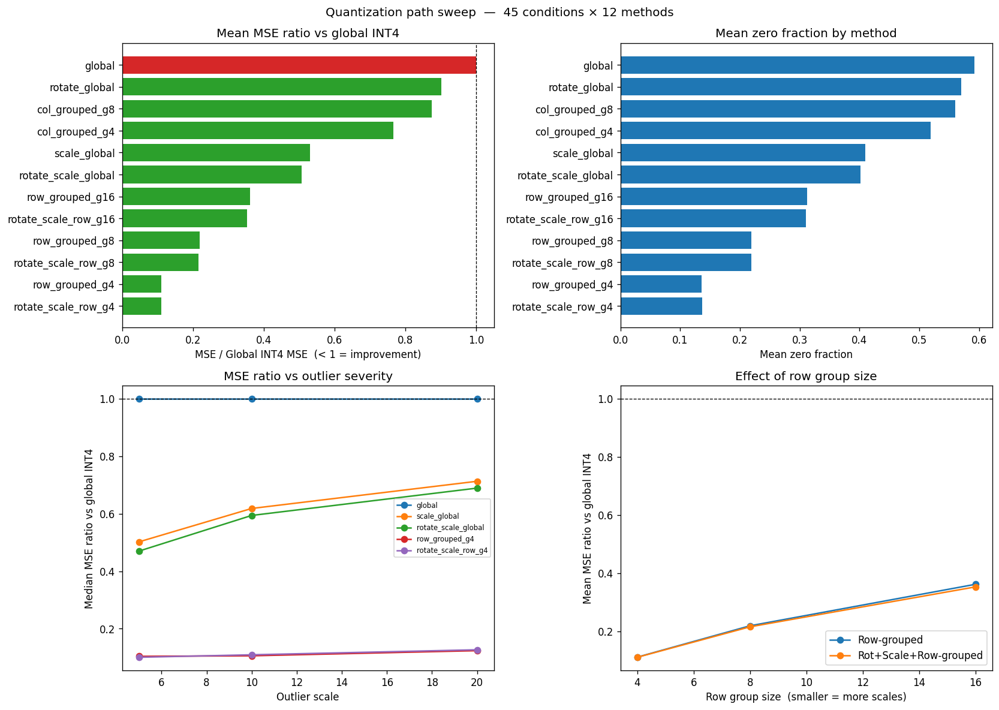

*Figure: Four-panel sweep dashboard for 32×32 matrices. Rotation paths in this figure use one selected channel-pair rotation per matrix condition (0.2016% of possible pairs). Top left — mean MSE ratio per method with standard-deviation error bars (green bars indicate improvement over global INT4, dashed line at 1.0). Top right — mean zero fraction per method with standard-deviation error bars. Bottom left — median MSE ratio vs outlier scale for key methods. Bottom right — mean MSE ratio vs row group size for row-grouped and rotate+scale+row-grouped paths.*

10. A second sweep on larger 320×320 matrices (5 seeds × 3 new outlier fractions × 3 new outlier scales = 45 conditions, 15 methods including col_grouped_g16 and row/rotate_scale_row group sizes up to 32) reveals how findings scale with matrix size and random-scatter outliers.

Rotation budget for the shown 320×320 results: the `rotate_global`,
`rotate_scale_global`, and `rotate_scale_row_g*` methods again used exactly
**one** pair rotation per matrix condition. A 320-column matrix has
$320 \times 319 / 2 = 51{,}040$ possible unordered channel pairs, so the
rotation budget was **1/51,040 pairs = 0.0020%** of possible pairs per
condition. Non-rotation methods used zero rotations.

| Method | MSE ratio mean | MSE ratio std | Zero frac mean | Zero frac std |
|---|---:|---:|---:|---:|
| row_grouped_g4 | **0.143** | 0.091 | 0.187 | 0.082 |
| rotate_scale_row_g4 | **0.143** | 0.091 | 0.187 | 0.082 |
| row_grouped_g8 | 0.274 | 0.159 | 0.307 | 0.140 |
| rotate_scale_row_g8 | 0.274 | 0.159 | 0.307 | 0.140 |
| row_grouped_g16 | 0.427 | 0.211 | 0.432 | 0.181 |
| rotate_scale_row_g16 | 0.427 | 0.211 | 0.432 | 0.181 |
| rotate_scale_row_g32 | 0.573 | 0.220 | 0.536 | 0.190 |
| row_grouped_g32 | 0.573 | 0.219 | 0.536 | 0.190 |
| rotate_scale_global | 0.844 | 0.155 | 0.685 | 0.186 |
| scale_global | 0.845 | 0.155 | 0.686 | 0.186 |
| col_grouped_g4 | 0.898 | 0.127 | 0.700 | 0.177 |
| col_grouped_g8 | 0.919 | 0.111 | 0.706 | 0.174 |
| col_grouped_g16 | 0.937 | 0.094 | 0.711 | 0.171 |
| rotate_global | 0.965 | 0.057 | 0.721 | 0.165 |
| global | 1.000 | 0.000 | 0.731 | 0.159 |

Key observations from the large-matrix sweep: (a) row_grouped_g4 still achieves ~7× MSE reduction, confirming the finding scales to larger matrices; (b) rotation now adds **zero** measurable benefit over row-grouped or scaling alone — differences are at the fourth decimal place — suggesting rotation's marginal advantage at 32×32 was noise rather than signal; (c) per-channel scaling (scale_global = 0.845) is far less effective than at 32×32 (0.531) because random scatter means almost every column contains outliers, leaving no column to rescale beneficially; (d) column-grouped quantization collapses toward global (0.90–0.94) confirming it cannot address random-scatter outliers at any group size; (e) group size remains the dominant variable for row-grouped across both matrix sizes.

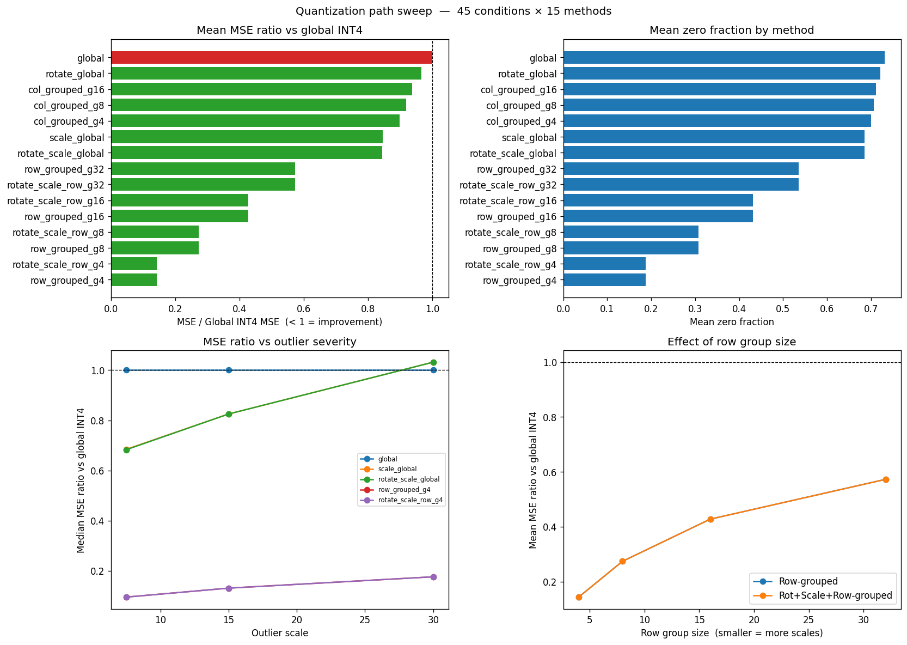

*Figure: Four-panel sweep dashboard for 320×320 matrices with random-scatter outliers. Rotation paths in this figure use one selected channel-pair rotation per matrix condition (0.0020% of possible pairs). Error bars in the top panels show standard deviation across sweep conditions. Notable: rotation and scaling alone converge toward global INT4 performance; only row-grouped paths provide substantial improvement.*

11. Top-width sparse-rotation sweeps repeat the 32×32 and 320×320 grids while
adding `top_width_pair_fractions=[0.05, 0.10, 0.20]`. The method names p5, p10,
and p20 refer to the candidate pool: the top 5%, 10%, or 20% of channel pairs by
max-abs width difference. Because the selected rotations are constrained to be
independent, the actual number of applied pair rotations is much smaller than
the candidate pool size.

For 32×32 matrices, p5/p10/p20 selected an average of 2.42/3.78/5.24 independent
pair rotations per condition, corresponding to 0.488%/0.762%/1.057% of all 496
possible channel pairs.

| Method | MSE mean | MSE std | Zero mean | Zero std | Avg. rotations | Actual pair fraction | Candidate fraction |
|---|---:|---:|---:|---:|---:|---:|---:|
| row_grouped_g4 | **0.1115** | 0.0591 | 0.1359 | 0.0531 | 0.00 | 0.000% | 0% |
| rotate_scale_row_g4 | **0.1110** | 0.0587 | 0.1365 | 0.0529 | 1.00 | 0.202% | 0% |
| top_width_rotate_scale_p5_row_g4 | **0.1116** | 0.0590 | 0.1405 | 0.0544 | 2.42 | 0.488% | 5% |
| top_width_rotate_scale_p10_row_g4 | 0.1122 | 0.0589 | 0.1415 | 0.0559 | 3.78 | 0.762% | 10% |
| top_width_rotate_scale_p20_row_g4 | 0.1121 | 0.0592 | 0.1437 | 0.0594 | 5.24 | 1.057% | 20% |
| scale_global | 0.5307 | 0.2115 | 0.4101 | 0.1933 | 0.00 | 0.000% | 0% |
| rotate_scale_global | **0.5068** | 0.2162 | 0.4017 | 0.1923 | 1.00 | 0.202% | 0% |
| top_width_rotate_scale_p5_global | 0.5318 | 0.2138 | 0.4269 | 0.1995 | 2.42 | 0.488% | 5% |
| top_width_rotate_scale_p10_global | 0.5277 | 0.2100 | 0.4303 | 0.1976 | 3.78 | 0.762% | 10% |
| top_width_rotate_scale_p20_global | 0.5146 | 0.1981 | 0.4270 | 0.1914 | 5.24 | 1.057% | 20% |
| rotate_global | 0.9021 | 0.0787 | 0.5702 | 0.2041 | 1.00 | 0.202% | 0% |
| top_width_rotate_p5_global | 0.8848 | 0.0836 | 0.5671 | 0.2052 | 2.42 | 0.488% | 5% |
| top_width_rotate_p10_global | 0.8514 | 0.0952 | 0.5570 | 0.2064 | 3.78 | 0.762% | 10% |
| top_width_rotate_p20_global | **0.8114** | 0.1196 | 0.5433 | 0.2090 | 5.24 | 1.057% | 20% |

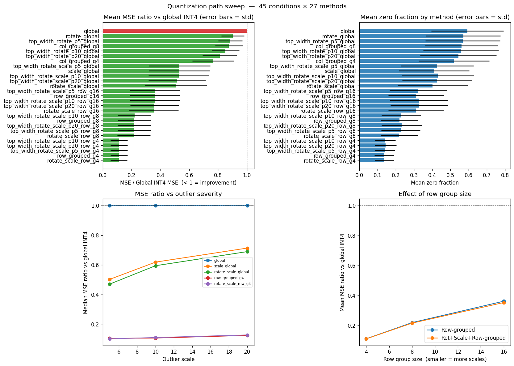

*Figure: 32×32 sweep with top-width sparse rotations added. Error bars in the top panels show standard deviation across sweep conditions. Increasing the
candidate percentage improves rotation-only global quantization, but it does not
beat row-grouped quantization or the original one-pair rotate+scale+row path.*

For 320×320 matrices, p5/p10/p20 selected an average of
24.53/37.33/56.47 independent pair rotations per condition. Even p20 therefore
rotated only about 0.111% of the 51,040 possible channel pairs.

| Method | MSE mean | MSE std | Zero mean | Zero std | Avg. rotations | Actual pair fraction | Candidate fraction |
|---|---:|---:|---:|---:|---:|---:|---:|
| row_grouped_g4 | **0.1432** | 0.0910 | 0.1874 | 0.0821 | 0.00 | 0.000% | 0% |
| rotate_scale_row_g4 | **0.1432** | 0.0910 | 0.1874 | 0.0820 | 1.00 | 0.002% | 0% |
| top_width_rotate_scale_p5_row_g4 | 0.1446 | 0.0925 | 0.1877 | 0.0809 | 24.53 | 0.048% | 5% |
| top_width_rotate_scale_p10_row_g4 | 0.1453 | 0.0935 | 0.1879 | 0.0804 | 37.33 | 0.073% | 10% |
| top_width_rotate_scale_p20_row_g4 | 0.1463 | 0.0944 | 0.1885 | 0.0795 | 56.47 | 0.111% | 20% |
| scale_global | 0.8448 | 0.1545 | 0.6857 | 0.1859 | 0.00 | 0.000% | 0% |
| rotate_scale_global | 0.8439 | 0.1553 | 0.6851 | 0.1859 | 1.00 | 0.002% | 0% |
| top_width_rotate_scale_p5_global | 0.8347 | 0.1659 | 0.6763 | 0.1852 | 24.53 | 0.048% | 5% |
| top_width_rotate_scale_p10_global | 0.8305 | 0.1718 | 0.6716 | 0.1851 | 37.33 | 0.073% | 10% |
| top_width_rotate_scale_p20_global | **0.8201** | 0.1816 | 0.6640 | 0.1847 | 56.47 | 0.111% | 20% |
| rotate_global | 0.9650 | 0.0571 | 0.7213 | 0.1648 | 1.00 | 0.002% | 0% |
| top_width_rotate_p5_global | 0.9284 | 0.1028 | 0.7049 | 0.1733 | 24.53 | 0.048% | 5% |
| top_width_rotate_p10_global | **0.9270** | 0.1112 | 0.7012 | 0.1745 | 37.33 | 0.073% | 10% |
| top_width_rotate_p20_global | 0.9274 | 0.1190 | 0.6973 | 0.1754 | 56.47 | 0.111% | 20% |

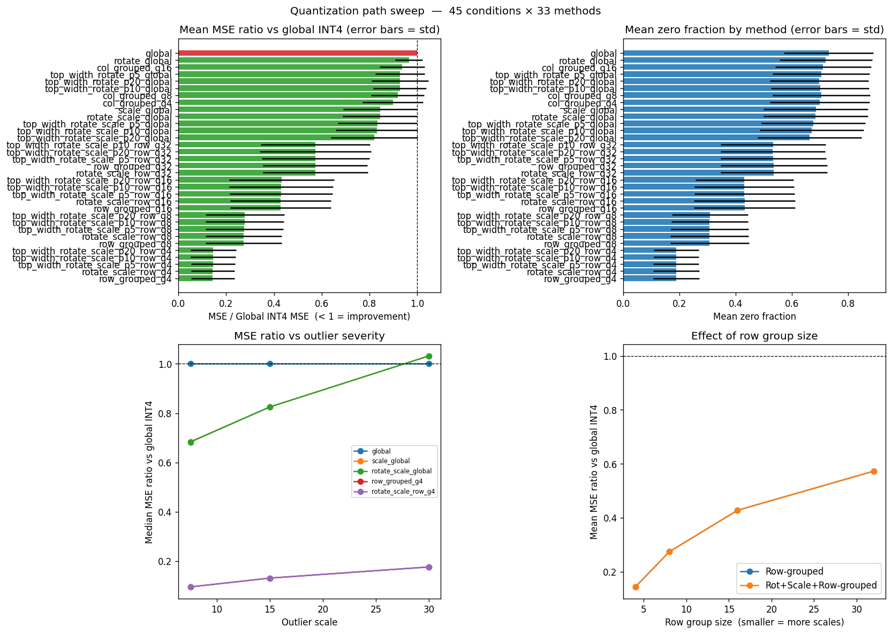

*Figure: 320×320 sweep with top-width sparse rotations added. Error bars in the top panels show standard deviation across sweep conditions. Sparse rotations
improve global rotation and global rotation+scaling paths, especially at p20,
but row-grouped quantization remains the dominant factor.*

The top-width sweeps sharpen the interpretation of rotations. Sparse multi-pair
rotations are better than the old single-pair `rotate_global` path, especially
when combined with scaling on the 320×320 matrices. However, once row-grouped
quantization is used, adding more top-width rotations does not improve the best
MSE ratios; it slightly worsens them in both matrix sizes. This suggests that,
in the current synthetic setup, row-local scaling handles the main outlier
failure mode more directly than column-pair rotations. The result does not rule
out ParoQuant-style rotations for transformer layers, where calibration-aware
angle optimization and activation structure may change the tradeoff.

## 12. First Tiny Transformer Run

The first Milestone 3 transformer run applies the harness to all compatible
linear layers in `sshleifer/tiny-gpt2`. The model has two transformer blocks,
and the harness quantized eight GPT-2 `Conv1D` layers:

- `transformer.h.{0,1}.attn.c_attn`
- `transformer.h.{0,1}.attn.c_proj`
- `transformer.h.{0,1}.mlp.c_fc`
- `transformer.h.{0,1}.mlp.c_proj`

The run used the built-in calibration text batch and compared INT4 and INT8
versions of all configured transformer paths. The output files were:

- `results/transformer_weight_metrics.csv`
- `results/transformer_activation_metrics.csv`
- `results/transformer_logit_metrics.csv`
- `plots/transformer_dashboard.png`

The tracked paper figure is:

- `docs/figures/transformer_dashboard_tiny_gpt2.png`

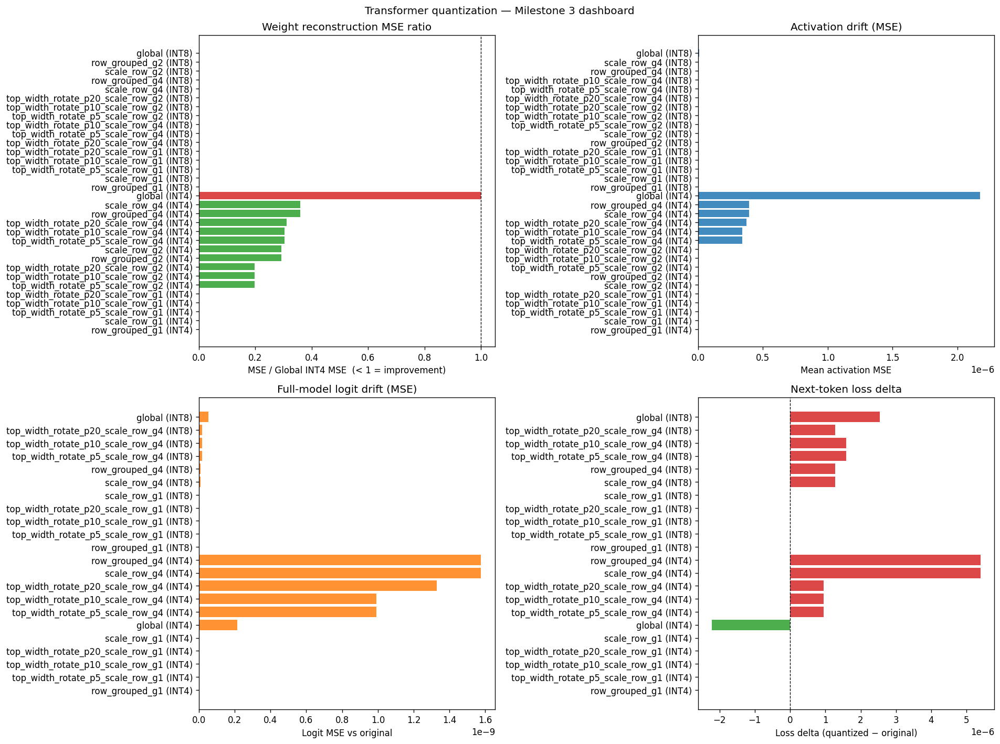

*Figure: all-layer `sshleifer/tiny-gpt2` run. The MSE panels use log scale so
that INT4 and INT8 paths are visible on the same figure without INT8 bars being
compressed by the much larger INT4 scale. The signed loss-delta panel uses a
symmetric log scale so tiny and large deltas remain visible around zero. The
panels summarize mean weight reconstruction error, activation drift, full-model
logit drift, and next-token loss delta across the implemented quantization
paths.*

Because this model is intentionally tiny, several matrices have only two input
rows. This makes `g1` row grouping a near-lossless or exactly lossless case and
causes saturation fractions of 1.0 for those paths. These `g1` rows are useful
for validating the harness, but they should not be interpreted as evidence that
one-row groups are a realistic compression strategy for larger transformers.

The next two tables average weight and activation metrics across the eight
quantized layers, with INT4 and INT8 shown separately. `Rel Fro` is relative
Frobenius error. `Act rel err` is relative activation drift.

**INT4 weight and activation summary**

| Method | Bits | Weight MSE | Rel Fro | W cos | SNR dB | Zero frac | Sat frac | Act MSE | Act cos | Act rel err |
|---|---:|---:|---:|---:|---:|---:|---:|---:|---:|---:|
| global | 4 | 2.595e-06 | 0.0811 | 0.996680 | 22.29 | 0.1719 | 0.1146 | 2.175e-06 | 0.986809 | 0.1094 |
| row_grouped_g1 | 4 | 0.000e+00 | 0.0000 | 1.000000 | inf | 0.0000 | 1.0000 | 0.000e+00 | 0.991084 | 0.0000 |
| row_grouped_g2 | 4 | 7.593e-07 | 0.0365 | 0.999353 | 29.02 | 0.0625 | 0.5000 | 4.597e-10 | 0.999453 | 0.0217 |
| row_grouped_g4 | 4 | 9.314e-07 | 0.0440 | 0.998964 | 27.48 | 0.1042 | 0.4453 | 3.941e-07 | 0.988157 | 0.0718 |
| scale_row_g1 | 4 | 1.915e-19 | 0.0000 | 1.000000 | 158.03 | 0.0000 | 1.0000 | 1.989e-19 | 0.991084 | 0.0000 |
| scale_row_g2 | 4 | 7.593e-07 | 0.0365 | 0.999353 | 29.02 | 0.0625 | 0.5000 | 4.597e-10 | 0.999453 | 0.0217 |
| scale_row_g4 | 4 | 9.314e-07 | 0.0440 | 0.998964 | 27.48 | 0.1042 | 0.4453 | 3.941e-07 | 0.988157 | 0.0718 |
| top_width_rotate_p10_scale_row_g1 | 4 | 6.492e-19 | 0.0000 | 1.000000 | 153.59 | 0.0000 | 1.0000 | 2.096e-19 | 0.991084 | 0.0000 |
| top_width_rotate_p10_scale_row_g2 | 4 | 5.132e-07 | 0.0293 | 0.999544 | 31.07 | 0.0000 | 0.5312 | 5.797e-10 | 0.998948 | 0.0253 |
| top_width_rotate_p10_scale_row_g4 | 4 | 7.896e-07 | 0.0420 | 0.999060 | 27.90 | 0.0729 | 0.4453 | 3.402e-07 | 0.988519 | 0.0697 |
| top_width_rotate_p20_scale_row_g1 | 4 | 6.531e-19 | 0.0000 | 1.000000 | 153.36 | 0.0000 | 1.0000 | 2.186e-19 | 0.991084 | 0.0000 |
| top_width_rotate_p20_scale_row_g2 | 4 | 5.132e-07 | 0.0293 | 0.999544 | 31.07 | 0.0000 | 0.5312 | 5.797e-10 | 0.998948 | 0.0253 |
| top_width_rotate_p20_scale_row_g4 | 4 | 8.080e-07 | 0.0430 | 0.999020 | 27.66 | 0.0807 | 0.4453 | 3.708e-07 | 0.988496 | 0.0707 |
| top_width_rotate_p5_scale_row_g1 | 4 | 6.492e-19 | 0.0000 | 1.000000 | 153.59 | 0.0000 | 1.0000 | 2.096e-19 | 0.991084 | 0.0000 |
| top_width_rotate_p5_scale_row_g2 | 4 | 5.132e-07 | 0.0293 | 0.999544 | 31.07 | 0.0000 | 0.5312 | 5.797e-10 | 0.998948 | 0.0253 |
| top_width_rotate_p5_scale_row_g4 | 4 | 7.896e-07 | 0.0420 | 0.999060 | 27.90 | 0.0729 | 0.4453 | 3.402e-07 | 0.988519 | 0.0697 |

**INT8 weight and activation summary**

| Method | Bits | Weight MSE | Rel Fro | W cos | SNR dB | Zero frac | Sat frac | Act MSE | Act cos | Act rel err |
|---|---:|---:|---:|---:|---:|---:|---:|---:|---:|---:|
| global | 8 | 7.531e-09 | 0.0042 | 0.999991 | 47.85 | 0.0000 | 0.1146 | 8.406e-09 | 0.991153 | 0.0065 |
| row_grouped_g1 | 8 | 0.000e+00 | 0.0000 | 1.000000 | inf | 0.0000 | 1.0000 | 0.000e+00 | 0.991084 | 0.0000 |
| row_grouped_g2 | 8 | 3.097e-09 | 0.0023 | 0.999997 | 52.91 | 0.0000 | 0.5000 | 1.156e-12 | 0.999439 | 0.0012 |
| row_grouped_g4 | 8 | 2.497e-09 | 0.0024 | 0.999997 | 52.82 | 0.0000 | 0.4375 | 1.176e-09 | 0.991151 | 0.0037 |
| scale_row_g1 | 8 | 1.915e-19 | 0.0000 | 1.000000 | 158.03 | 0.0000 | 1.0000 | 1.989e-19 | 0.991084 | 0.0000 |
| scale_row_g2 | 8 | 3.097e-09 | 0.0023 | 0.999997 | 52.91 | 0.0000 | 0.5000 | 1.156e-12 | 0.999439 | 0.0012 |
| scale_row_g4 | 8 | 2.497e-09 | 0.0024 | 0.999997 | 52.82 | 0.0000 | 0.4375 | 1.176e-09 | 0.991151 | 0.0037 |
| top_width_rotate_p10_scale_row_g1 | 8 | 6.492e-19 | 0.0000 | 1.000000 | 153.59 | 0.0000 | 1.0000 | 2.096e-19 | 0.991084 | 0.0000 |
| top_width_rotate_p10_scale_row_g2 | 8 | 2.417e-09 | 0.0023 | 0.999997 | 52.75 | 0.0000 | 0.5000 | 2.119e-12 | 0.999437 | 0.0016 |
| top_width_rotate_p10_scale_row_g4 | 8 | 2.363e-09 | 0.0023 | 0.999997 | 53.20 | 0.0000 | 0.4375 | 1.048e-09 | 0.991098 | 0.0042 |
| top_width_rotate_p20_scale_row_g1 | 8 | 6.531e-19 | 0.0000 | 1.000000 | 153.36 | 0.0000 | 1.0000 | 2.186e-19 | 0.991084 | 0.0000 |
| top_width_rotate_p20_scale_row_g2 | 8 | 2.417e-09 | 0.0023 | 0.999997 | 52.75 | 0.0000 | 0.5000 | 2.119e-12 | 0.999437 | 0.0016 |
| top_width_rotate_p20_scale_row_g4 | 8 | 2.312e-09 | 0.0022 | 0.999997 | 53.38 | 0.0000 | 0.4375 | 9.624e-10 | 0.991098 | 0.0042 |
| top_width_rotate_p5_scale_row_g1 | 8 | 6.492e-19 | 0.0000 | 1.000000 | 153.59 | 0.0000 | 1.0000 | 2.096e-19 | 0.991084 | 0.0000 |
| top_width_rotate_p5_scale_row_g2 | 8 | 2.417e-09 | 0.0023 | 0.999997 | 52.75 | 0.0000 | 0.5000 | 2.119e-12 | 0.999437 | 0.0016 |
| top_width_rotate_p5_scale_row_g4 | 8 | 2.363e-09 | 0.0023 | 0.999997 | 53.20 | 0.0000 | 0.4375 | 1.048e-09 | 0.991098 | 0.0042 |

The `g2` rows appear only for the two 8-row projection layers where dynamic row
group resolution produced group size 2. Non-rotation rows have
`rotation_count=0`, `rotation_pair_fraction=0.0`, and
`rotation_candidate_fraction=0.0`. Top-width rows record the configured
candidate fractions in the method name: p5, p10, and p20 correspond to
`rotation_candidate_fraction` 0.05, 0.10, and 0.20. On this tiny model, these
paths selected roughly one independent rotation per layer on average; p5/p10
selected 1.00 rotations per layer and p20 selected 1.125. The average actual
pair fraction was about 52.6% for p5/p10 and 53.0% for p20 because many layers
have only two or six output channels. The `g2` top-width subset appears only on
two projection layers and selected one rotation per layer, i.e. 100% of possible
pairs for those two-column weights.

The next two tables report the all-layer full-model output comparison. The
baseline original loss was 10.822957, giving original perplexity 50,159.19 on
the short calibration text batch. All tested quantized variants preserve the
top-5 token sets exactly on this small batch, and all perplexity ratios stay
within about six parts per million of 1.0.

**INT4 logit, loss, and perplexity summary**

| Method | Bits | Logit MSE | Logit cos | Top-5 overlap | Loss delta | Perplexity | PPL ratio |
|---|---:|---:|---:|---:|---:|---:|---:|
| global | 4 | 2.143e-10 | 1.00000000 | 1.0000 | -2.225e-06 | 50159.08 | 0.99999777 |
| row_grouped_g1 | 4 | 0.000e+00 | 1.00000000 | 1.0000 | +0.000e+00 | 50159.19 | 1.00000000 |
| row_grouped_g4 | 4 | 1.575e-09 | 0.99999785 | 1.0000 | +5.404e-06 | 50159.46 | 1.00000540 |
| scale_row_g1 | 4 | 1.362e-18 | 1.00000000 | 1.0000 | +0.000e+00 | 50159.19 | 1.00000000 |
| scale_row_g4 | 4 | 1.575e-09 | 0.99999785 | 1.0000 | +5.404e-06 | 50159.46 | 1.00000540 |
| top_width_rotate_p10_scale_row_g1 | 4 | 8.882e-19 | 1.00000000 | 1.0000 | +0.000e+00 | 50159.19 | 1.00000000 |
| top_width_rotate_p10_scale_row_g4 | 4 | 9.920e-10 | 0.99999887 | 1.0000 | +9.537e-07 | 50159.24 | 1.00000095 |
| top_width_rotate_p20_scale_row_g1 | 4 | 9.350e-19 | 1.00000000 | 1.0000 | +0.000e+00 | 50159.19 | 1.00000000 |
| top_width_rotate_p20_scale_row_g4 | 4 | 1.329e-09 | 0.99999887 | 1.0000 | +9.537e-07 | 50159.24 | 1.00000095 |
| top_width_rotate_p5_scale_row_g1 | 4 | 8.882e-19 | 1.00000000 | 1.0000 | +0.000e+00 | 50159.19 | 1.00000000 |
| top_width_rotate_p5_scale_row_g4 | 4 | 9.920e-10 | 0.99999887 | 1.0000 | +9.537e-07 | 50159.24 | 1.00000095 |

**INT8 logit, loss, and perplexity summary**

| Method | Bits | Logit MSE | Logit cos | Top-5 overlap | Loss delta | Perplexity | PPL ratio |
|---|---:|---:|---:|---:|---:|---:|---:|
| global | 8 | 5.412e-11 | 1.00000000 | 1.0000 | +2.543e-06 | 50159.32 | 1.00000254 |
| row_grouped_g1 | 8 | 0.000e+00 | 1.00000000 | 1.0000 | +0.000e+00 | 50159.19 | 1.00000000 |
| row_grouped_g4 | 8 | 8.602e-12 | 0.99999982 | 1.0000 | +1.272e-06 | 50159.25 | 1.00000127 |
| scale_row_g1 | 8 | 1.362e-18 | 1.00000000 | 1.0000 | +0.000e+00 | 50159.19 | 1.00000000 |
| scale_row_g4 | 8 | 8.602e-12 | 0.99999982 | 1.0000 | +1.272e-06 | 50159.25 | 1.00000127 |
| top_width_rotate_p10_scale_row_g1 | 8 | 8.882e-19 | 1.00000000 | 1.0000 | +0.000e+00 | 50159.19 | 1.00000000 |
| top_width_rotate_p10_scale_row_g4 | 8 | 1.750e-11 | 0.99999988 | 1.0000 | +1.589e-06 | 50159.27 | 1.00000159 |
| top_width_rotate_p20_scale_row_g1 | 8 | 9.350e-19 | 1.00000000 | 1.0000 | +0.000e+00 | 50159.19 | 1.00000000 |
| top_width_rotate_p20_scale_row_g4 | 8 | 1.800e-11 | 0.99999988 | 1.0000 | +1.272e-06 | 50159.25 | 1.00000127 |
| top_width_rotate_p5_scale_row_g1 | 8 | 8.882e-19 | 1.00000000 | 1.0000 | +0.000e+00 | 50159.19 | 1.00000000 |
| top_width_rotate_p5_scale_row_g4 | 8 | 1.750e-11 | 0.99999988 | 1.0000 | +1.589e-06 | 50159.27 | 1.00000159 |

The first transformer result is best read as an integration validation rather
than a performance claim. It confirms that the matrix-level quantization paths,
rotation metadata, activation drift measurement, logit similarity, loss, and
perplexity accounting all run on a real HuggingFace causal LM. The result is
also deliberately conservative: `sshleifer/tiny-gpt2` is too small and too weak
for its perplexity values to be substantively meaningful. The useful signal is
that the measurement pipeline is now complete; the next question is whether the
same patterns survive on larger tiny models such as TinyStories-1M, Pythia-14M,
Pythia-70M, and DistilGPT2.

## 13. TinyStories-1M Transformer Run

The second Milestone 3 run applies the same harness to
`roneneldan/TinyStories-1M`, a small GPT-Neo-style model with eight transformer
blocks. The harness found 48 compatible linear layers:

- attention `k_proj`, `v_proj`, `q_proj`, and `out_proj` layers in each block
- MLP `c_fc` and `c_proj` layers in each block

This run produced 1008 weight records, 1008 activation records, and 14
full-model logit/loss records. It also exposed one useful harness design issue:
full-model logit/loss rows are easiest to interpret when the same method exists
for every selected layer. Dynamic row-group sizes and top-width rotation counts
can otherwise create layer-specific method names. The harness now caps
top-width rotation fractions model-wide: it computes the widest selected layer's
possible channel-pair count and lowers each requested fraction if needed so
`round(total_pairs * fraction)` stays within `max_rotation_pairs=1000` for every
layer. Duplicate effective fractions are deduplicated. For TinyStories-1M,
requested p5/p10/p20 rotations all collapse to one common p3.0637% path, which
allows the 256-output MLP expansion layers to participate instead of being
skipped.

The output files were written under model-specific local folders:

- `results/transformer_tinystories_1m/transformer_weight_metrics.csv`
- `results/transformer_tinystories_1m/transformer_activation_metrics.csv`
- `results/transformer_tinystories_1m/transformer_logit_metrics.csv`
- `plots/transformer_tinystories_1m/transformer_dashboard.png`

The tracked paper figure is:

- `docs/figures/transformer_dashboard_tinystories_1m.png`

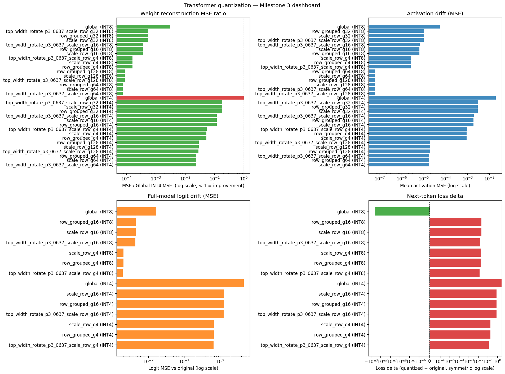

*Figure: all-layer `roneneldan/TinyStories-1M` run. MSE panels use log scale,
and the signed loss-delta panel uses symmetric log scale. The top panels
summarize per-layer weight reconstruction and activation drift across all
available methods. The bottom panels use method names available for every
selected layer, including the model-wide capped p3.0637% top-width rotation
path.*

The TinyStories result is the first less-degenerate transformer signal. INT4
global quantization strongly damages the short-batch full-model behavior:
perplexity rises by 16.1x and top-5 token overlap drops to 0.328. Row-grouped
INT4 substantially reduces the damage. With group size 4, the perplexity ratio
falls to 1.213 and top-5 overlap rises to 0.633. The capped top-width
rotate+scale+row g4 path improves this further: perplexity ratio 1.137 and
top-5 overlap 0.689. INT8 stays much closer to the original model; global INT8
has much smaller logit drift than INT4 global, and the small negative loss delta
is best treated as noise from the tiny evaluation batch rather than a quality
improvement.

**TinyStories-1M all-layer logit, loss, and perplexity summary**

Bold rows mark the best rotation/grouping story within each bitwidth. The red
INT8 global row marks the lowest PPL ratio, but it is treated as small-batch
noise rather than a real improvement.

| Method | Bits | Logit MSE | Top-5 overlap | Loss delta | PPL ratio |
|---|---:|---:|---:|---:|---:|
| global | 4 | 4.657 | 0.3278 | +2.7797 | 16.1149 |
| row_grouped_g4 | 4 | 0.673 | 0.6333 | +0.1932 | 1.2131 |
| row_grouped_g16 | 4 | 1.316 | 0.4278 | +0.8066 | 2.2402 |
| scale_row_g4 | 4 | 0.673 | 0.6333 | +0.1932 | 1.2131 |
| scale_row_g16 | 4 | 1.316 | 0.4278 | +0.8066 | 2.2403 |
| **top_width_rotate_p3_0637_scale_row_g4** | **4** | **0.660** | **0.6889** | **+0.1284** | **1.1370** |
| top_width_rotate_p3_0637_scale_row_g16 | 4 | 1.264 | 0.4722 | +0.8105 | 2.2490 |
| <span style="color:red">**global**</span> | <span style="color:red">**8**</span> | <span style="color:red">**0.0165**</span> | <span style="color:red">**0.9389**</span> | <span style="color:red">**-0.0404**</span> | <span style="color:red">**0.9604**</span> |
| row_grouped_g4 | 8 | 0.0020 | 0.9778 | +0.0181 | 1.0182 |
| row_grouped_g16 | 8 | 0.0044 | 0.9833 | +0.0212 | 1.0214 |
| scale_row_g4 | 8 | 0.0020 | 0.9778 | +0.0180 | 1.0182 |
| scale_row_g16 | 8 | 0.0044 | 0.9833 | +0.0212 | 1.0214 |
| **top_width_rotate_p3_0637_scale_row_g4** | **8** | **0.0019** | **0.9778** | **+0.0139** | **1.0140** |
| top_width_rotate_p3_0637_scale_row_g16 | 8 | 0.0043 | 0.9722 | +0.0167 | 1.0168 |

The highlighted INT8 global row should not be interpreted as quantization
improving the model; its below-1.0 perplexity ratio is likely small-batch noise.
Among row-grouped/rotation INT8 paths, capped rotation g4 has the lowest
perplexity ratio.

The aggregate weight and activation results tell the same story: row-grouped g4
is about 19x lower than global INT4 in mean weight MSE and about 21x lower in
mean activation MSE across the 48 layers. Scaling is effectively identical to
plain row-grouping in this run, which matches the matrix-level finding that
group size is the dominant variable once local row groups are available. The
capped rotation result is more nuanced: it modestly improves the all-layer g4
full-model row, but does not rescue the coarser g16 path.

## 14. Pythia-14M Baseline Runs

The third Milestone 3 run applies the harness to `EleutherAI/pythia-14m` (14M
parameters, GPT-NeoX architecture, 6 transformer blocks). The run used the
benchmark runner at conservative settings: INT8 and INT4 separately, no
rotations, `--local-files-only`, two Torch CPU threads, and incremental CSV
writes. The methods were: `global`, `row_grouped_g4`, `row_grouped_g32`,
`scale_row_g4`, `scale_row_g32`.

The harness found 45 compatible linear layers per run (6 × 4 attention/MLP
layers + embed_in/out layers where applicable). This produced 225 weight records
and 225 activation records per bitwidth run, and 5 full-model logit/loss rows per
run. Results were written to model-specific subdirectories:

- `results/transformer_pythia_14m_int8_baseline/`
- `results/transformer_pythia_14m_int4_baseline/`

### 14.1 INT8 results

**INT8 all-layer logit, loss, and perplexity summary (original PPL: 534.99)**

| Method | Bits | Logit MSE | Top-5 overlap | Loss delta | PPL | PPL ratio |
|---|---:|---:|---:|---:|---:|---:|
| global | 8 | 0.8466 | 0.6722 | +0.2115 | 660.98 | 1.2355 |
| row_grouped_g4 | 8 | 0.0130 | 0.9500 | −0.0056 | 531.99 | **0.9944** |
| row_grouped_g32 | 8 | 0.0172 | 0.9556 | +0.0173 | 544.34 | 1.0175 |
| scale_row_g4 | 8 | 0.0142 | 0.9611 | +0.0084 | 539.52 | 1.0085 |
| scale_row_g32 | 8 | 0.0161 | 0.9611 | +0.0188 | 545.15 | 1.0190 |

The most important observation is that **INT8 global is no longer lossless** on
this model: PPL ratio 1.24 and top-5 overlap drops to 0.672. On `sshleifer/
tiny-gpt2` and `roneneldan/TinyStories-1M`, INT8 global was essentially
transparent (PPL ratios 1.000025 and 0.960 respectively, where the sub-1 ratio
for TinyStories was treated as small-batch noise). This is the first run where
INT8 global produces a measurable, interpretable degradation, confirming that a
single global scale cannot hold across 45 layers of a real GPT-NeoX model.

`row_grouped_g4` at INT8 achieves a PPL ratio of **0.994** — effectively
lossless and marginally below baseline due to small-batch noise. `scale_row_g4`
is similar (1.008). This demonstrates that fine-grained row grouping recovers
full INT8 fidelity even where global INT8 cannot.

### 14.2 INT4 results

**INT4 all-layer logit, loss, and perplexity summary (original PPL: 534.99)**

| Method | Bits | Logit MSE | Top-5 overlap | Loss delta | PPL | PPL ratio |
|---|---:|---:|---:|---:|---:|---:|
| global | 4 | 35.67 | 0.1278 | +9.621 | 8,064,445 | **15,074** |
| row_grouped_g4 | 4 | 0.931 | 0.7056 | +0.285 | 711.30 | 1.3296 |
| row_grouped_g32 | 4 | 2.470 | 0.4778 | +0.923 | 1,347.06 | 2.5179 |
| scale_row_g4 | 4 | 0.928 | 0.7056 | +0.276 | 705.20 | **1.3182** |
| scale_row_g32 | 4 | 2.460 | 0.4778 | +0.930 | 1,356.23 | 2.5351 |

INT4 global is catastrophic: PPL 8M, logit MSE 35.7, top-5 token overlap 0.128.
The model is essentially random after global INT4. `row_grouped_g4` reduces the
PPL ratio to 1.33 and `scale_row_g4` to 1.32. The two are nearly identical,
consistent with the matrix-level finding that scaling and fine-grained row
grouping serve the same outlier-isolation function. Group size is again the
dominant variable: g4 gives 1.33×, g32 gives 2.52×.

### 14.3 Cross-model INT4 row_grouped_g4 progression

| Model | Param count | Orig PPL | g4 PPL | PPL ratio |
|---|---:|---:|---:|---:|
| sshleifer/tiny-gpt2 | ~0.1M | 50,159 | 50,159 | ~1.000 |
| roneneldan/TinyStories-1M | 1M | 10,471 | 12,703 | 1.213 |
| EleutherAI/pythia-14m | 14M | 535 | 711 | 1.330 |
| EleutherAI/pythia-70m | 70M | 165 | 1,243 | 7.520 |

The tiny-gpt2 result is a harness-validation point, not a meaningful
compression benchmark (the model is too small and its PPL already near-random on
any useful text). TinyStories-1M and Pythia-14m show a consistent degradation of
1.2–1.3x at INT4 row_grouped_g4. Pythia-70m breaks this trend sharply: the PPL
ratio jumps to 7.52x despite the model having a much lower original PPL (165 vs
535). See Section 15 for full Pythia-70m results and analysis.

### 14.4 Key finding: INT8 global is not assumption-safe on 14M+ models

The Pythia-14m INT8 global result (PPL ratio 1.24) is a qualitative shift from
the earlier runs. It establishes that:

1. Global INT8 is not lossless at this model scale under the current calibration
   text batch.
2. Row-grouped INT8 at g4 restores losslessness.
3. INT4 global is never safe on a real model regardless of scale.
4. For INT4 on real models, group size 4 vs 32 is a >2x quality difference.

This makes INT8 grouping a research-relevant question for this project, not just
INT4 grouping.

## 15. Pythia-70M Baseline Runs

The fourth Milestone 3 run applies the harness to `EleutherAI/pythia-70m` (70M
parameters, GPT-NeoX architecture, 6 transformer blocks). The run used identical
settings to Pythia-14m: INT8 and INT4 separately, no rotations,
`--local-files-only`, two Torch CPU threads, incremental CSV writes. Methods
were: `global`, `row_grouped_g4`, `row_grouped_g128`, `scale_row_g4`,
`scale_row_g128`. The harness found 45 compatible linear layers per run,
producing 225 weight records, 225 activation records, and 5 logit/loss rows.

Run timings: INT8 ≈ 798s (13.3 min); INT4 = 780s (13.0 min). Both bitwidths
took essentially the same wall-clock time, confirming that quantization runtime
is dominated by weight passes, not bitwidth arithmetic.

Results were written to model-specific subdirectories:

- `results/transformer_pythia_70m_int8_baseline/`
- `results/transformer_pythia_70m_int4_baseline/`

### 15.1 INT8 results

**INT8 all-layer logit, loss, and perplexity summary (original PPL: 165.34)**

| Method | Bits | Logit MSE | Top-5 overlap | Loss delta | PPL | PPL ratio |
|---|---:|---:|---:|---:|---:|---:|
| global | 8 | 54.52 | 0.600 | +0.365 | 238.26 | 1.441 |
| row_grouped_g4 | 8 | 1.685 | 0.744 | −0.029 | 160.55 | **0.971** |
| row_grouped_g128 | 8 | 1.514 | 0.728 | −0.120 | 146.59 | 0.887 |
| scale_row_g4 | 8 | 1.448 | 0.750 | −0.057 | 156.21 | 0.945 |
| scale_row_g128 | 8 | 1.591 | 0.756 | −0.127 | 145.68 | 0.881 |

INT8 global degrades further on the 70m model: PPL ratio 1.44 vs 1.24 on 14m.
The logit MSE of 54.52 is substantially higher than the 14m value (0.847), and
top-5 overlap drops to 0.60. This confirms the per-scale degradation trend with
model size: a single global scale cannot hold across the weight diversity of a
larger model.

All row-grouped and scale-row methods produce sub-1 PPL ratios, which under a
small calibration batch means effectively lossless or within noise. The sub-1
values here (0.97–0.88) are slightly larger in magnitude than those seen in
14m runs, suggesting the small-batch PPL estimator has more variance at 70m's
lower baseline PPL of 165.

### 15.2 INT4 results

**INT4 all-layer logit, loss, and perplexity summary (original PPL: 165.34)**

| Method | Bits | Logit MSE | Top-5 overlap | Loss delta | PPL | PPL ratio |
|---|---:|---:|---:|---:|---:|---:|
| global | 4 | 195,102 | 0.000 | +33.85 | 8.28×10¹⁶ | ~501 trillion |
| row_grouped_g4 | 4 | 16.671 | 0.200 | +2.018 | 1,243.3 | **7.520** |
| row_grouped_g128 | 4 | 108.342 | 0.100 | +8.187 | 594,052 | 3,593 |
| scale_row_g4 | 4 | 16.116 | 0.244 | +2.038 | 1,268.6 | 7.673 |
| scale_row_g128 | 4 | 111.297 | 0.083 | +8.166 | 582,012 | 3,520 |

INT4 global destroys the model entirely (PPLx ~501 trillion, top-5 overlap
zero). This mirrors Pythia-14m and TinyStories-1M — INT4 global is
universally catastrophic on real models.

The striking result is `row_grouped_g4`, which gives PPL ratio **7.52x** on 70m
versus 1.33x on 14m. The absolute PPL rises from 165 to 1,243. This is a
substantial regression: INT4 g4 that was near-usable on 14m is clearly degraded
on 70m. Several contributing factors:

1. **Larger matrices**: Pythia-70m has hidden size 512 and MLP intermediate 2048
   vs 128/512 in 14m. Row dimension is 4x larger, but g4 still captures only 4
   rows per group — the same absolute granularity on a much more complex weight
   distribution.
2. **Lower original PPL**: A model with PPL 165 has more learned structure to
   lose. Small quantization errors that push the model off its manifold produce
   larger absolute PPL increases when the baseline is low.
3. **Weight distribution diversity**: 70m has 5x more parameters distributed
   across the same 6 blocks, resulting in larger and more heterogeneous
   weight tensors where a fixed small group size captures less of the local
   variance structure.

The group-size effect remains extreme at INT4: g4 gives 7.52x but g128 gives
3,593x — a 478x difference from changing only the group boundary. This
dwarfs the 1.9x g4/g32 ratio on 14m and establishes group size as the
dominant quantization variable at 70m scale.

`scale_row` (per-column scaling before row grouping) provides negligible
additional benefit over raw row grouping at both INT4 g4 (7.67 vs 7.52) and g128
(3,520 vs 3,593), consistent with the matrix-level finding that these two
mechanisms serve the same outlier-suppression role.

### 15.3 Scaling behaviour: 14m → 70m

| Metric | Pythia-14m | Pythia-70m | Change |
|---|---:|---:|---|
| Original PPL | 534.99 | 165.34 | 3.2× lower (stronger model) |
| INT8 global PPLx | 1.24 | 1.44 | +16% worse |
| INT8 g4 PPLx | 0.994 | 0.971 | within noise |
| INT4 global PPLx | 15,074 | ~501 trillion | much worse |
| INT4 g4 PPLx | 1.330 | 7.520 | 5.65× worse |
| INT4 g4 top-5 | 0.706 | 0.200 | sharply lower |

INT8 with fine grouping remains safe. INT4 with g4 degrades much faster than
model scale suggests — the 70m model quantizes worse at g4 than the 14m model
despite being a stronger language model.

### 15.4 Key finding: INT4 g4 does not scale safely to 70m

The 14m runs established that INT4 row_grouped_g4 is near-usable (1.33x PPL).
The 70m data shows this does not hold at the next scale step. The degradation is
qualitative, not just quantitative: top-5 overlap drops from 0.71 to 0.20,
meaning 80% of the model's top-5 next-token predictions are wrong after g4
quantization. This motivates either finer grouping (g1 or g2), rotation
pre-processing to reduce outlier energy, or a combination of both before INT4 is
practically usable on models of this size.

## 16. Limitations

The current results are intentionally preliminary.

- Matrices are synthetic. Outliers are placed at uniformly random positions, not with the spatial structure seen in transformer activations.
- Rotation-pair selection now includes both a simple two-largest-column heuristic and an opt-in top-width-difference independent-pair heuristic. It still does not optimize pair choices or angles using transformer calibration data.
- Scaling balances full-column max-absolute values, not groups or learned activation-aware statistics.
- The first transformer benchmark uses `sshleifer/tiny-gpt2`, whose linear layers are extremely small; the near-lossless `g1` row-grouped results are therefore harness-validation evidence, not a realistic compression result.
- The TinyStories-1M and Pythia-14M benchmarks are more informative than tiny-gpt2, but all runs use the same tiny built-in calibration text batch.
- The language-model evaluation currently uses a tiny built-in calibration text batch. Perplexity and top-k overlap need a larger held-out text set before they should be treated as benchmark-quality language-model results. The near-zero and sub-1 PPL ratio values seen in some runs are small-batch noise artefacts.

These limitations are useful: they define the next experiments rather than weakening the value of the sandbox.

## 17. Next Work

The next research steps move from harness validation to transformer-level
evidence on less degenerate models and evaluation text.

1. ~~Run the same all-layer harness on `EleutherAI/pythia-14m`~~ — **complete** (Section 14). ~~`EleutherAI/pythia-70m` baselines~~ — **complete** (Section 15). Next: `distilgpt2` baselines, then rotation presets on both 14m and 70m.
2. Replace or supplement the built-in calibration strings with a larger held-out text batch for loss/perplexity evaluation.
3. Compare rotation-pair selection strategies (max-abs pair vs. Jacobi-sweep vs. learned).
4. Scale to larger open-source LLMs and compare against GPTQ and AWQ published results.

## Appendix A. Reproducing Current Figures


Core experiment commands:

```bash
MPLCONFIGDIR=/tmp/paroquant-mpl .venv/bin/python experiments/baseline_experiment.py
MPLCONFIGDIR=/tmp/paroquant-mpl .venv/bin/python experiments/outlier_experiment.py
MPLCONFIGDIR=/tmp/paroquant-mpl .venv/bin/python experiments/analyze_results.py
MPLCONFIGDIR=/tmp/paroquant-mpl .venv/bin/python experiments/rotation_experiment.py
MPLCONFIGDIR=/tmp/paroquant-mpl .venv/bin/python experiments/sweep_experiment.py
MPLCONFIGDIR=/tmp/paroquant-mpl .venv/bin/python experiments/transformer_experiment.py
```

Current tracked figure references used in this draft:

- `docs/figures/research_matrix_families.png`
- `docs/figures/research_int4_gaussian_comparison.png`
- `docs/figures/research_outlier_histograms.png`
- `docs/figures/analysis_dashboard.png`
- `docs/figures/channel_scaling_dashboard.png`
- `docs/figures/rotation_scaling_comparison.png`
- `docs/figures/sweep_dashboard.png`
- `docs/figures/sweep_dashboard_320x320.png`
- `docs/figures/sweep_dashboard_top_width_32x32.png`
- `docs/figures/sweep_dashboard_top_width_320x320.png`
- `docs/figures/transformer_dashboard_tiny_gpt2.png`

Generated experiment outputs under `plots/` and `results/` remain local ignored artifacts. Paper figures are copied into `docs/figures/` when they are ready to be referenced by the tracked draft.
